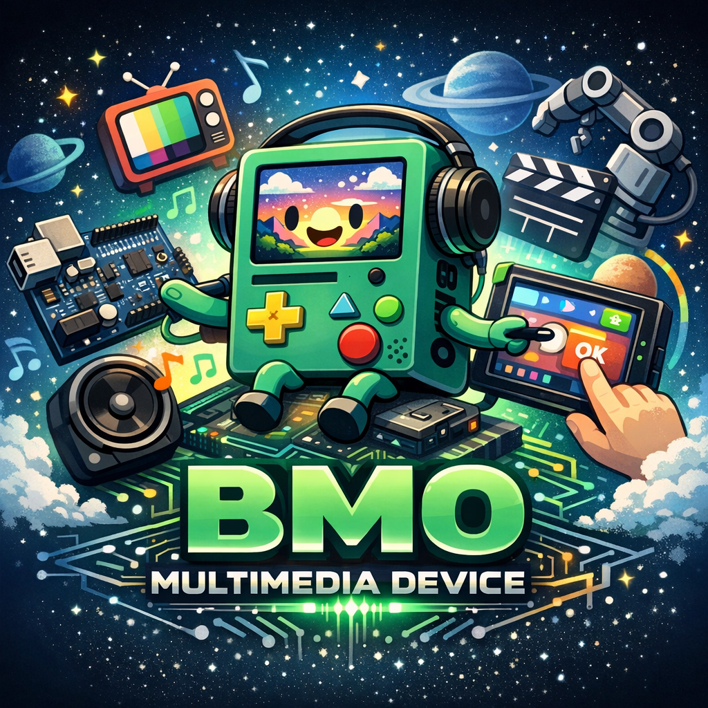
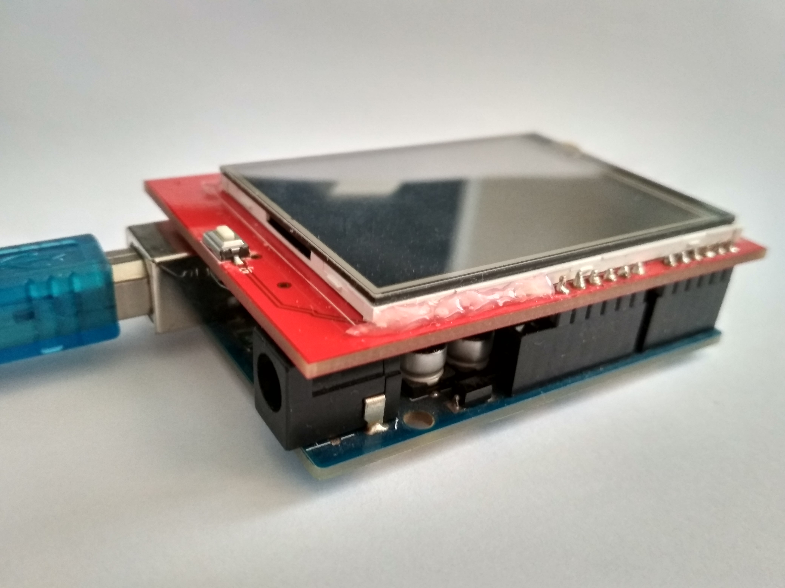
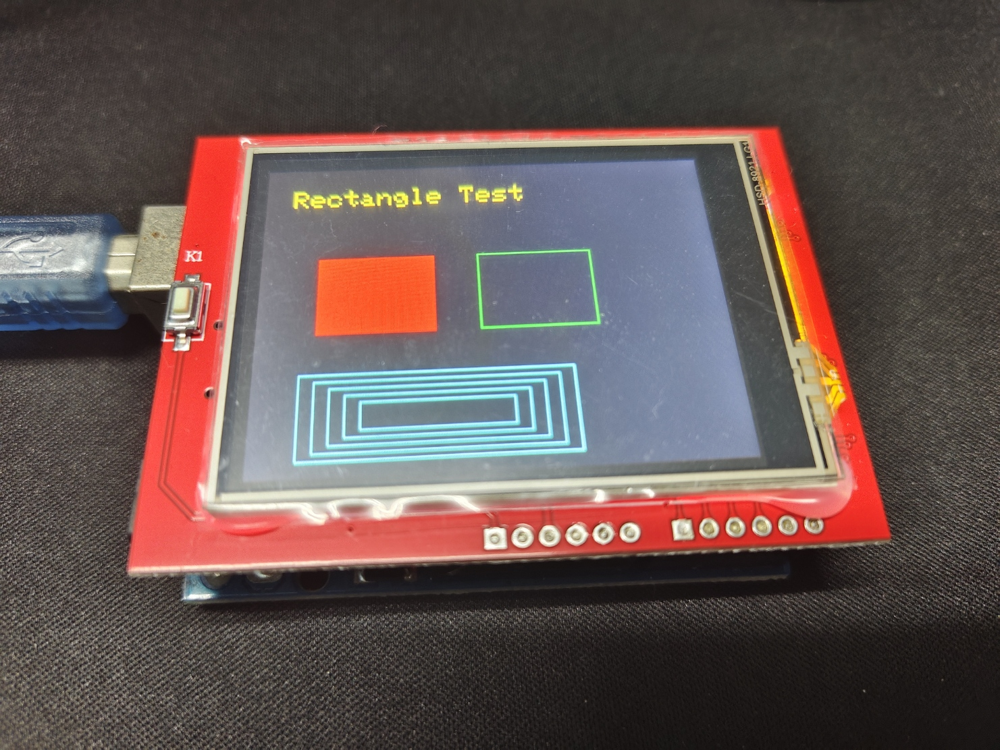
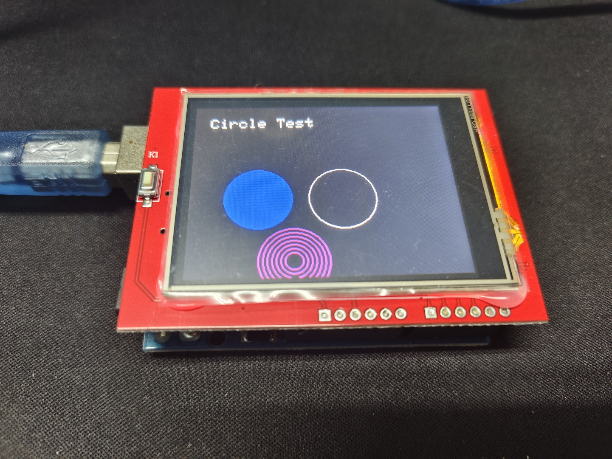
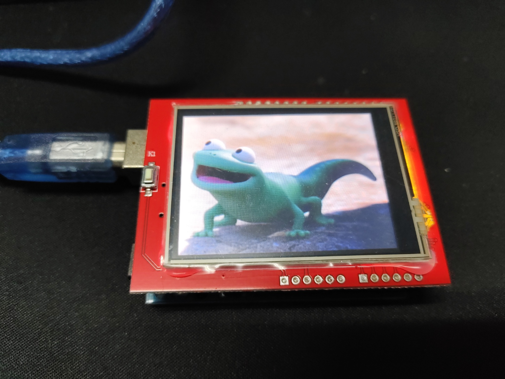

# BMO 多媒體裝置 (BMO-Multimedia-Device)

本專案以 ESP32 為核心，製作一個《探險活寶》中 BMO 外型的桌面多媒體裝置。  
裝置將能從 SD card 讀取影像並透過 LCD 顯示，並逐步加入音效播放、按鍵互動功能，甚至透過 WiFi 上傳圖片與語音，最終完成一個可互動的 BMO 多媒體裝置。

---

## 專案目標

本專案將從基礎硬體測試開始，逐步完成各項功能並整合為完整系統。規劃目標如下：

- 使用 Arduino UNO 搭配 ILI9341 LCD 顯示基本圖形（如圓形、矩形等）
- 從 SD card 載入影像並顯示於 LCD
- 加入 LCD 模組觸控功能
- 改用 ESP32 驅動 LCD 模組，提升畫面更新速度
- 加入喇叭模組播放音效
- 加入按鍵互動功能
- 設計並製作 PCB 電路板，整合各項硬體模組
- 繪製並列印 BMO 外型的 3D 列印外殼
- 最終整合為一個具有 BMO 外觀的多媒體裝置

由於所使用的 LCD 模組可直接插入 Arduino UNO 板，初期將以 UNO 進行圖片顯示測試。  
考量 UNO 的運算能力有限，後續功能將移植至 ESP32 以提升畫面更新速度與整體效能。

  
  

## 專案進度

- [X] Arduino UNO 平台測試
  - [X] 成功顯示基本圖形（矩形 / 圓形）
  - [X] 從 SD card 載入影像並顯示於 LCD
  - [X] LCD 觸控功能測試

- [ ] 移植至 ESP32 平台
  - [ ] 驅動 LCD 顯示模組
  - [ ] 完整移植 UNO 已完成功能
  - [ ] 提升畫面更新速度（高速刷新）
  - [ ] 喇叭模組播放音效
  - [ ] 按鍵互動功能

- [ ] PCB 電路板設計與整合

- [ ] 3D 列印 BMO 外殼

- [ ] 完整系統整合

---

## 專案展示

### 🔹 **成功顯示基本圖形（矩形 / 圓形）**
  - LCD 模組可正常運作
  
  - 詳細實作流程可見  
    👉 [Issue #1 - 顯示基本圖形（矩形 / 圓形](https://github.com/chi611/BMO-Multimedia-Device/issues/1)

  
  

---

### 🔹 **從 SD card 載入影像並顯示於 LCD**
  - 成功從 SD Card 讀取影像資料並顯示於 TFT LCD 
  - 將圖片轉為 **RGB565** 格式，降低 Arduino 運算量
  - 單張圖片顯示時間約 **1.3 秒**  
  
  - 詳細實作流程可見  
    👉 [Issue #2 - 從 SD cad 載入影像並顯示於 LCD](https://github.com/chi611/BMO-Multimedia-Device/issues/2)

  

---

### 🔹 **LCD 觸控功能測試**
  - 完成電阻式觸控功能測試
  - 透過壓力值（Z）判斷觸控狀態
  - 可透過觸控點擊切換圖片

  - 詳細說明可見  
    👉 [Issue #3 - 觸控功能與圖片切換](https://github.com/chi611/BMO-Multimedia-Device/issues/3)

#### 🎬 成果展示

<video src="https://github.com/user-attachments/assets/bbcd9260-cd45-4666-beb7-aaf69e4ce3ae" width="30%" autoplay loop muted playsinline></video>

---

### 🔹 功能完成（GIF 顯示與互動控制）

  - 實現 GIF 動畫顯示（透過拆分圖片並轉為 RGB565 `.raw`）
  - 完成觸控互動功能，並依狀態機切換不同動畫

  - 詳細說明可見  
  👉 [Issue #5 - 實作觸控狀態機，整合 10s 閒置偵測、觸控偵測與 GIF 動畫播放](https://github.com/chi611/BMO-Multimedia-Device/issues/5)

#### 🧠 系統狀態架構圖

#### 🖼️ 圖片素材

| 初始畫面（ori.bmp）                                                                                            | 閒置動畫（idle.gif）                                                                                           | 觸發動畫（touch.gif）                                                                                          |
| -------------------------------------------------------------------------------------------------------- | -------------------------------------------------------------------------------------------------------- | -------------------------------------------------------------------------------------------------------- |
|  |  |  |

#### 🎬 成果展示

<video src="https://github.com/user-attachments/assets/3a9ba620-2303-4a3c-9630-5411374319d6" width="50%" autoplay loop muted playsinline></video>

#### ⚠️ 目前限制

由於系統畫面更新速度受限（約 **1.25 秒 / frame**），目前顯示效果尚無法達到一般 GIF 的流暢度。

主要原因如下：

* SD 卡讀取速度限制
* SPI 傳輸頻寬不足（LCD 更新速度瓶頸）
* UNO 效能不足

因此在實際操作中，動畫呈現較接近「逐張圖片切換」，而非連續流暢播放。

#### 🔧 後續優化方向

* 改用效能較高的平台（如 ESP32）
* 提升 SPI clock 或改用更快的顯示介面

---

## 專案目的

此專案作為個人 side project，目的是練習：

- 嵌入式系統設計
- SPI 顯示控制
- 圖片處理
- Git 專案管理

